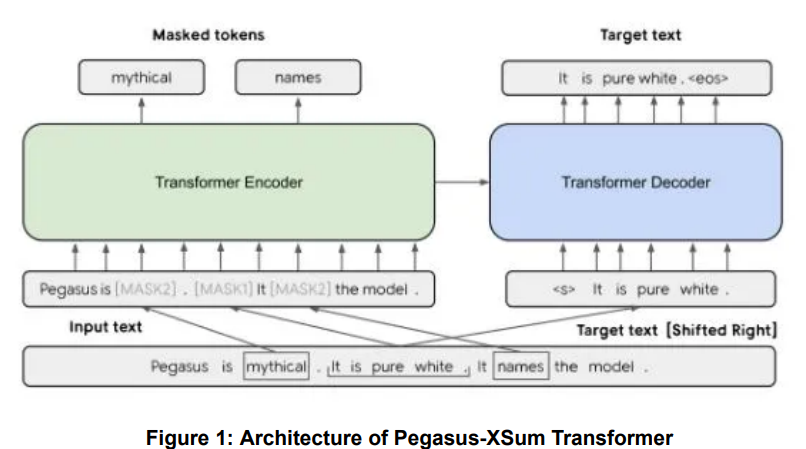
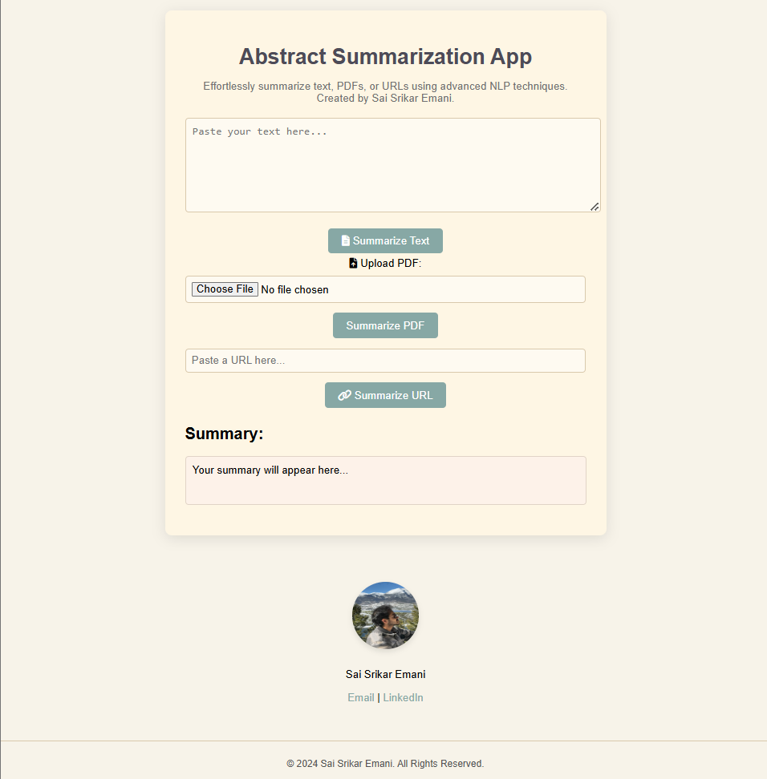

# Abstractive Summarization App

## **Project Overview**
This project implements an abstractive text summarization system using transformer-based models like Pegasus. The app provides an interface to summarize:
- Plain text
- PDF documents
- Web content via URLs

## **Features**
- Supports abstractive summarization of scientific papers, news articles, and general content.
- User-friendly interface for uploading PDFs, entering text, or pasting URLs.
- Backend powered by Python's Flask framework and Pegasus transformer model.

## **File Structure**
SUMMARIZATION_APP/ ├── app/ │ ├── deployment_model/ │ │ ├── config.json │ │ ├── generation_config.json │ │ ├── model.safetensors │ │ ├── special_tokens_map.json │ │ ├── spiece.model │ │ ├── tokenizer_config.json │ ├── app.py ├── static/ │ ├── images/ │ │ ├── adiyogi.jpg │ │ ├── ss.jpg │ │ ├── ss1.jpg │ │ ├── ss2.jpg │ ├── scripts.js │ ├── styles.css ├── templates/ │ ├── index.html ├── venv/ │ ├── ... ├── .gitignore ├── pyvenv.cfg ├── requirements.txt


## **Installation Instructions**
1. Clone this repository:
   ```bash
   git clone https://github.com/your-username/abstractive-summarization-app.git
sss
2. Navigate to the project directory:
cd abstractive-summarization-app

3. Create a virtual environment and activate it 
python -m venv venv
source venv/bin/activate    # On Linux/Mac
venv\Scripts\activate       # On Windows

4. Install dependencies
pip install -r requirements.txt

## **Model Setup**
The pre-trained Pegasus model used in this project is available as part of the GitHub release. 

### **Download the Model**
Use the following command to download the model directly to the `app/deployment_model/` directory:
```bash
wget https://github.com/your-username/repo-name/releases/download/v1.0.0/model.safetensors -P app/deployment_model/


# Usage
1. Run the Flask app
python app/app.py

2. Open your browser and navigate to:
http://127.0.0.1:5000/


# Technologies Used
- Backend: Flask, Python
- Model: Pegasus-XSum (Hugging Face Transformers)
- Frontend: HTML, CSS, JavaScript
- Dependencies: PyPDF2, BeautifulSoup Flask, Hugging Face Transformers


# Screenshots

## Model Architectire


## App Interface



# Credits
- Developer: Sai Srikar Emani
- Model Source: Pegasus by Hugging Face: https://huggingface.co/google/pegasus-xsum


# Future Work
- Adding multilingual summarization support.
- Enhancing performance for real-time summarization.
- Deploying the app on cloud platforms (AWS, Azure).